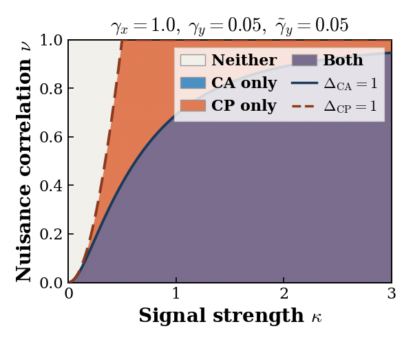

# When to Align, When to Predict?
### A Phase Diagram for Multimodal Self-Supervised Learning

<div align="center">

[](TODO)
[](https://huggingface.co/datasets/Ilayk/mm_align_vs_pred)
[](https://ilaymalinyak.github.io/mm_align_vs_pred/)
[](https://colab.research.google.com/github/IlayMalinyak/mm_align_vs_pred/blob/main/notebooks/interactive_linear_experiment_colab.ipynb)

</div>

<div align="center">

</div>

> As target-modality nuisance variance (γ̃_y) grows, the **CP region collapses** — Cross-Prediction gets trapped reconstructing high-variance noise instead of the shared signal. Cross-Alignment is immune.

---

## Overview

We characterize *when* contrastive (Cross-Alignment, CA) vs. predictive (Cross-Prediction, CP) self-supervised objectives recover shared signal in multimodal data, under the **Spiked Covariance Model** framework.

The answer is a **phase diagram** over (κ, ν) — signal strength vs. nuisance cross-modal correlation — with four regimes:

| Region | CA recovers? | CP recovers? |
|--------|:---:|:---:|
| **Both** | ✓ | ✓ |
| **CA only** | ✓ | ✗ |
| **CP only** | ✗ | ✓ |
| **Neither** | ✗ | ✗ |

We validate on synthetic vision datasets (dSprites, Shapes3D), image-caption data (COCO), and real astrophysical data (LAMOST × Kepler/TESS spectra).

---

## Datasets

| Dataset | How to get it |
|---------|--------------|
| **dSprites** | Bundled in `src/dsprites/` (2.5 MB `.npz`) |
| **Shapes3D** | Auto-downloaded from [Google](https://storage.googleapis.com/3d-shapes/3dshapes.h5) |
| **COCO** | `pip install pycocotools` + standard download |
| **Astro** | Pretrained encoders & cached features on [HuggingFace](https://huggingface.co/datasets/Ilayk/mm_align_vs_pred) |

---

## Pretrained Models & Cached Features

```bash
# Download all (checkpoints + cached features + phase diagnostics data)
huggingface-cli download Ilayk/mm_align_vs_pred --repo-type dataset --local-dir hf_data
```

Or in Python:
```python
from huggingface_hub import snapshot_download
snapshot_download("Ilayk/mm_align_vs_pred", repo_type="dataset", local_dir="hf_data")
```

Point the astro experiment at the downloaded files:
```bash
export MULTIDESA_ROOT=hf_data
```

---

## Install

```bash
pip install -e .
pip install umap-learn   # optional, for UMAP visualizations
```

---

## Running Experiments

**Linear / theoretical** (fast, CPU-only):
```bash
python -m src.linear.run_experiment
```

**Synthetic vision** (dSprites / Shapes3D, SLURM):
```bash
sbatch cluster/dsprites_sweep.sbatch
sbatch cluster/shapes3d_sweep.sbatch
```

**COCO** (image-caption, SLURM):
```bash
sbatch cluster/coco_style_sweep.sbatch
```

**Astrophysical** (LAMOST × Kepler, requires HF data downloaded):
```bash
python -m src.astro.cross_modal --mode all --use_cached_features
```
See [`src/astro/README.md`](src/astro/README.md) for full setup.

---

## Phase Diagram Estimation

To estimate the CA and CP recovery regimes for your own dataset:
```bash
python src/analyze_phase_diagram.py --modality_x /path/to/X.npy --modality_y /path/to/Y.npy
```

---

## Tests

```bash
pytest tests/
```

---

## Citation

```bibtex
@article{,
  title   = {When to Align, When to Predict? A Phase Diagram for Multimodal Self-Supervised Learning},
  author  = {Kamai, Ilay and Van Assel, Hugues and Regev, Aviv and Perets, Hagai B. and Balestriero, Randall},
  journal = {arXiv preprint},
  year    = {2026}
}
```
